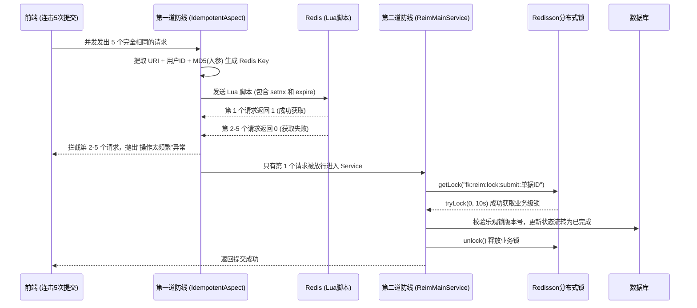
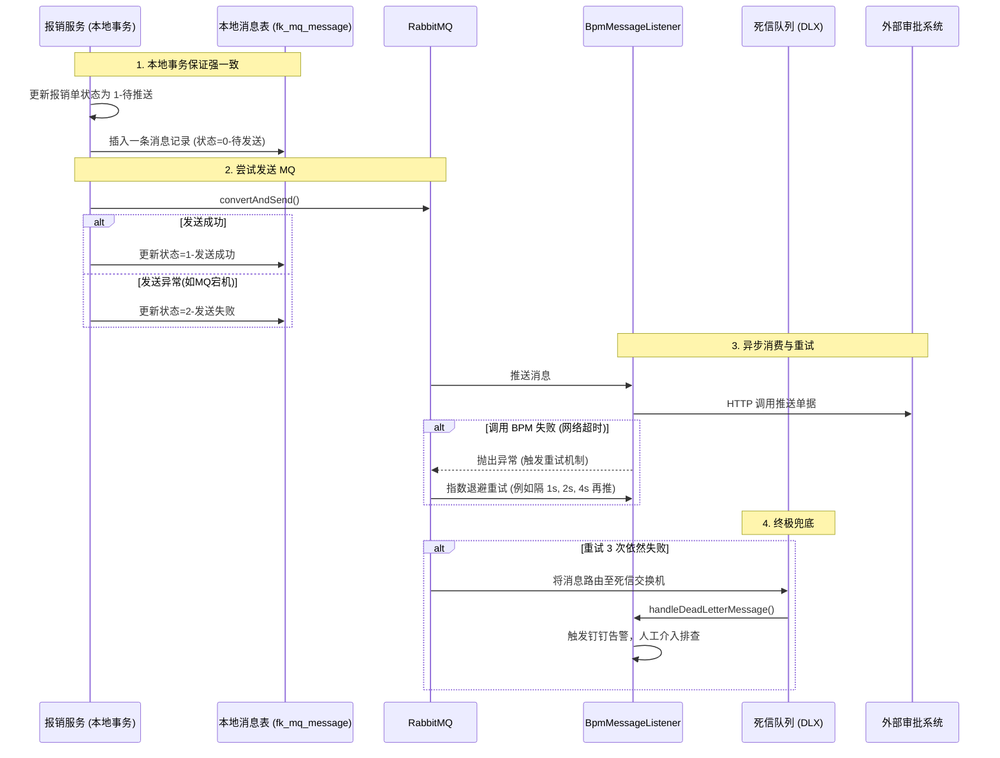

# 核心亮点深度剖析（答辩必杀技）

本文档专门针对你的“两大核心亮点”进行数据流向与底层原理的拆解。这是你在评委面前拿下高分（甚至满分）的关键所在。

---

## 🌟 亮点四：高并发下的防抖与防重发（接口幂等性）

> [!CAUTION]
> **业务痛点**：员工在外出差，网络信号极差（如高铁上）。点击“提交报销”后没反应，于是疯狂连击 5 次提交按钮。如果后端不加干预，会生成 5 张一模一样的报销单。

### 1. 双重加固架构图

### 2. 为什么需要“双重加固”？
- **AOP + Redis Lua 防抖（第一防线）**：它的颗粒度是“相同用户+相同请求参数”，目的是**拦截绝大部分无意义的网络重发流量**，不让它们打到数据库，保护系统性能。它保证了绝对的原子性。
- **Redisson 分布式锁（第二防线）**：它的颗粒度是“单据 ID”，目的是**保护业务逻辑的绝对一致性**。假如有一个审核人员和一个提交人员在同一毫秒对**同一张单子**进行操作，他们的入参肯定不一样（MD5不一样），第一道防线拦不住，这时就要靠 Redisson 把他们串行化，防止状态机错乱。

---

## 🌟 亮点三：分布式场景下的最终一致性保障

> [!WARNING]
> **业务痛点**：我们的系统把报销单状态更新成功了，准备推送给外网的 BPM 审批流。就在这时，网线被挖断了，或者 BPM 服务器宕机了。如果使用同步调用，系统会抛异常回滚，导致内部单据提交失败；如果直接异步不处理，会导致单据在我们这显示“已提交”，但在 BPM 那里根本没单子（彻底丢单）。

### 1. 最终一致性闭环流向

### 2. 本方案的三个绝杀设计
1. **本地消息表兜底发送**：就算发送给 MQ 那一步失败了，数据库里 `fk_mq_message` 表里依然静静地躺着一条状态为 `2` 的记录。由后台定时任务 (`BpmCompensationJob`) 每5分钟扫描一次，重新把它捞出来发给 MQ，确保 MQ 一定能收到。
2. **指数退避重试机制**：如果 BPM 短暂抽风，配置的 multiplier 让重试间隔越来越长，既能增加成功率，又不会把本来就脆弱的 BPM 直接打挂。
3. **死信队列 (DLQ) 告警机制**：机器不是万能的。如果 BPM 的服务器起火了，重试 100 次也没用。设定 3 次失败后进入 DLQ，触发钉钉告警让运维介入，实现了真正的 100% 不丢单闭环。
